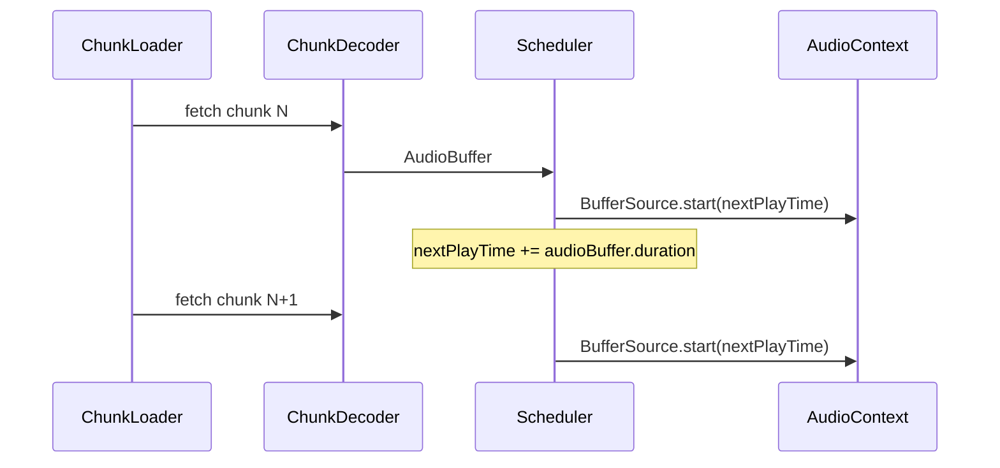
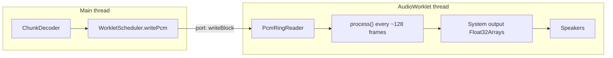
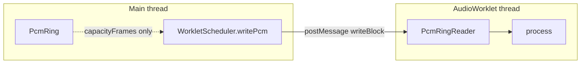

# Frontend design

Webview playback for CP's Nice Player — `StreamingAudioEngine`, schedulers, buffer policy, and UI integration.

**Related:** [Streaming playback architecture](stream.md) (backend, CNAP API, cache, end-to-end sequence).

---

### `StreamingAudioEngine` (replaces `AudioEngine`)

Stream-only playback — replace monolithic `load()` + single `AudioBuffer` with:


| Component        | Responsibility                                                                                                                   |
| ---------------- | -------------------------------------------------------------------------------------------------------------------------------- |
| **IndexClient**  | `fetch(\`${serverUrl}/index?audioId=${id})` → manifest with frame-aligned chunk map                                              |
| **ChunkLoader**  | Fetches chunks in `[playhead, playhead + chunkBufferCount − 1]`; priority queue; abort on seek                                   |
| **ChunkDecoder** | Per chunk: `decodeAudioData` or WebCodecs (reuse `_decodeWithWebCodecs` logic); output `{ pcm, sampleRate, channels, startSec }` |
| **PcmRing**      | Stores decoded float32 per channel for a time window; evicts far-behind playhead                                                 |
| **Scheduler**    | Drives `AudioContext` output — see [Scheduler options](#scheduler-options) (**production: Option B** via `WorkletScheduler`)                                    |


### Scheduler options

Two ways to turn decoded PCM into continuous speakers output. **Production player uses Option B** (`WorkletScheduler` + `AudioWorklet`); Option A is documented for reference.

#### Option A: Chained `AudioBufferSourceNode` + `nextPlayTime` (reference)

Each decoded chunk is a small `AudioBuffer`. The scheduler chains `AudioBufferSourceNode` instances on a single hardware timeline (`nextPlayTime`), similar to a reference WebCodecs + Web Audio pipeline.




**Schedule loop (per chunk):**

```js
if (nextPlayTime < audioCtx.currentTime) {
  nextPlayTime = audioCtx.currentTime;  // underrun snap — avoid gap
}
source.buffer = audioBuffer;
source.connect(gainNode);
source.start(nextPlayTime);
nextPlayTime += audioBuffer.duration;   // actual decoded length, not fixed 1s
```


| Aspect    | Detail                                                                            |
| --------- | --------------------------------------------------------------------------------- |
| **Play**  | Init or resume `nextPlayTime` from `audioCtx.currentTime - pausedAt`              |
| **Pause** | `stop()` active sources; save `pausedAt`                                          |
| **Seek**  | Stop sources, clear scheduled set, reload chunk window, reset timeline if playing |
| **Dedup** | `scheduledChunks: Set<index>` — do not schedule the same chunk twice              |


| Pros                                                    | Cons                                                                                           |
| ------------------------------------------------------- | ---------------------------------------------------------------------------------------------- |
| Simple; no extra worklet file or CSP concerns           | Many short sources over very long tracks                                                       |
| Easy seek/pause/resume                                  | Scheduling alone does not fix encode-edge discontinuities                                      |
| `nextPlayTime` reduces timing gaps vs fixed-time chunk math | Minor boundary clicks still possible on Ogg slices (mitigate with FFmpeg + optional crossfade) |
| Fast to ship and debug in webview                       |                                                                                                |


**Historical reference:** Option A was the initial v1 implementation; production now uses Option B in [`streamingAudioEngine.js`](media/streamingAudioEngine.js).

---

#### Option B: `AudioWorklet` + ring buffer (production)

A custom `AudioWorkletProcessor` pulls samples every **render quantum** (~128 frames, ~2.9 ms at 44.1 kHz). The main thread **writes** decoded PCM into a ring buffer via `MessagePort`; the worklet **reads** and fills system `outputs` in `process()`. **Integrated into `StreamingAudioEngine`** via `WorkletScheduler`.



##### Timing model (no sample scheduler)

Unlike Option A, Option B does **not** use `nextPlayTime` or per-chunk `BufferSource.start()`. The browser’s audio clock drives playback:

| Who | Responsibility |
| --- | --- |
| **Audio engine** | Calls `process(inputs, outputs)` once per render quantum while `AudioContext` is `running` |
| **Worklet** | Copy up to `output[0].length` frames (usually 128) from ring → `outputs[0][channel]`; output silence on underrun |
| **Main thread** | Keep ring stocked: decode chunks → `writePcm()` with **backpressure** when ring is full |

Each `process()` call is a small memcopy (~256 floats stereo ≪ 2.9 ms budget). Heavy work (decode, fetch, UI) stays on the main thread.

##### Source files


| File | Role |
| --- | --- |
| [`media/pcmRing.js`](../media/pcmRing.js) | Main-thread circular buffer helper (capacity tracking; used by `WorkletScheduler` for sizing; PCM path goes to worklet via messages) |
| [`media/pcmWorkletProcessor.js`](../media/pcmWorkletProcessor.js) | `AudioWorkletProcessor` + in-worklet `PcmRingReader` |
| [`media/workletScheduler.js`](../media/workletScheduler.js) | Load worklet module, `AudioWorkletNode`, `writePcm` with backpressure, play/pause/reset |

##### Ring buffer architecture (two buffers)

PCM crosses a thread boundary, so Option B uses **two separate storages** — not one shared ring:



| Class | File | Thread | Role |
| --- | --- | --- | --- |
| **`PcmRing`** | `pcmRing.js` | Main | Fixed per-channel `Float32Array`s; **`WorkletScheduler.init()` uses it only to compute `capacityFrames`** and pass into `processorOptions`. `writePcm()` does **not** copy into this ring today — PCM goes straight to the worklet via messages. |
| **`PcmRingReader`** | `pcmWorkletProcessor.js` | Audio (worklet) | **Playback queue.** Main thread writes via `writeBlock`; `process()` reads into system output buffers. |

**Why not `SharedArrayBuffer`?** Single shared ring would avoid the copy over `MessagePort`, but requires COOP/COEP headers. VS Code webviews use **`MessagePort`** instead (see [Message protocol](#message-protocol-main--worklet-port)).

**Storage layout (both rings):** one `Float32Array` per channel, length `capacityFrames = ceil(sampleRate × ringCapacitySec)`. Each **frame** (one time step) stores `channels[0][i]`, `channels[1][i]`, … in lockstep.

##### Index and fill-level semantics

`readIndex` and `writeIndex` are **array cursors**, not “sample number in the track.” They **do not grow without bound** — each advance wraps immediately:

```js
writeIndex = (writeIndex + 1) % capacityFrames;
readIndex  = (readIndex + 1) % capacityFrames;
```

So both indices always stay in `0 … capacityFrames − 1`.

Because indices wrap, **fill level is not `writeIndex - readIndex`**. The worklet ring tracks unread audio with a separate counter:

| Field | Role |
| --- | --- |
| `framesAvailable` | Unread frames queued between producer and consumer (0 … `capacityFrames`) |
| `freeFrames()` | `capacityFrames - framesAvailable` — space for the next `writeBlock` |

**Logical position in the file** (playhead seconds, chunk index, offset within chunk) lives in **`StreamingAudioEngine`**, not in ring indices. On seek: `reset()` clears the ring; refill from the seek chunk; playhead state is updated separately.

**Main-thread `PcmRing` nuance:** `writeIndex` also wraps with `% capacityFrames`, but `framesWritten` increments without bound (total frames ever written into that helper). `availableFrames()` returns `min(framesWritten, capacityFrames)`. This counter is unused on the hot playback path today.

##### Worklet ring buffer (`PcmRingReader`)

Per-channel `Float32Array` ring, capacity = `ceil(sampleRate × ringCapacitySec)`.

| Field | Meaning |
| --- | --- |
| `writeIndex` | Next slot to write (wraps with `% capacityFrames` each frame) |
| `readIndex` | Next slot to read (same wrapping) |
| `framesAvailable` | Unread frames in ring (≤ `capacityFrames`) |
| `underrunFrames` | Cumulative frames output as silence because ring was empty |

**Write (`writeBlock`) — producer, runs on worklet thread when port receives message:**

```
toWrite = min(requestedFrames, freeFrames)   // never overwrite unread data
for i in 0 .. toWrite-1:
  for each channel ch:
    channels[ch][writeIndex] = channelSamples[ch][i]
  writeIndex = (writeIndex + 1) % capacityFrames
framesAvailable += toWrite
return toWrite
```

If `freeFrames === 0`, accepts **0** frames; main thread must wait (`WorkletScheduler._waitForFreeFrames`).

**Read (`read`) — consumer, every `process()` call (usually 128 frames):**

```
for each output frame:
  if framesAvailable > 0:
    copy channels[ch][readIndex] → outputChannels[ch][frame]
    readIndex = (readIndex + 1) % capacityFrames
    framesAvailable -= 1
  else:
    output silence (0); underrunFrames += 1
```

**Example** (`capacityFrames = 8`, stereo): unread slots between `readIndex` and the region written ahead of it; `framesAvailable` counts how many frames can still be read.

```
slot:     [0][1][x][x][x][x][·][·]
          ↑ readIndex=2    ↑ writeIndex=6
          consumed         framesAvailable = 4
```

**Reset:** zero `readIndex`, `writeIndex`, `framesAvailable`, `underrunFrames`; triggered by `{ type: 'reset' }` on seek/restart.

**Ring sizing (integration):**

```
ringCapacitySec ≥ chunkBufferCount × chunkDurationSec + headroom
capacityFrames    = ceil(sampleRate × ringCapacitySec)
```

Too small → underruns (gaps). Too large → extra memory only.

##### Main-thread `PcmRing` (helper)

Optional write/read helpers on the main thread (`writeFromAudioBuffer`, `readChannelSlice` with wrap-aware copy). Used today for **capacity calculation** in `WorkletScheduler.init()`. May later mirror worklet state or batch samples before `postMessage`; not on the hot path in current `writePcm()`.

##### System output buffers vs ring

Each `process()` call receives **`outputs[0]`** — an array of per-channel `Float32Array`s allocated by the **Web Audio engine** for this callback only (typically length **128**). This is **not** the ring.

| Buffer | Owner | Lifetime | Purpose |
| --- | --- | --- | --- |
| **`PcmRingReader.channels`** | Worklet | Session | FIFO queue between decode and playback |
| **`outputs[0][ch]`** | Browser | Single `process()` call | “Write the next ~2.9 ms of sound here” |

Flow: ring → memcopy → `outputs` → DAC. The worklet must fill every output frame each callback (from ring or silence). Do not retain references to `outputs` across calls.

##### Ring sizing and audio layout

`channelCount` and `sampleRate` come from the **index manifest** (`channels`, `sampleRate`), populated by ffprobe during frame scan on the server. The worklet ring is sized from manifest layout — not from the first decoded chunk.

`WorkletScheduler.init()` runs **eagerly after index load** (alongside encoded-chunk prefetch). Decode and `writePcm()` remain gated on playback (`isPlaying`).

`AudioContext` is created with `{ sampleRate: manifest.sampleRate }` so `decodeAudioData` does not resample chunks to the device default (often 48000 Hz).

##### `WorkletScheduler` API

Main-thread coordinator — replaces Option A’s `nextPlayTime` / `BufferSource` scheduling. **Wired into [`streamingAudioEngine.js`](media/streamingAudioEngine.js).**

```js
// Requires pcmRing.js + workletScheduler.js (and pcmWorkletProcessor.js loaded by scheduler)
const scheduler = new WorkletScheduler({
  workletModuleUrl: processorUri,  // webview URI from asWebviewUri — see VS Code section
  ringCapacitySec: 15,             // default 10
  onStats(stats) { /* optional: underrunFrames, framesAvailable, freeFrames */ },
});

await scheduler.init(audioCtx, manifest.channels, manifest.sampleRate, { ringCapacitySec });

await scheduler.play();                    // AudioContext.resume()
await scheduler.writePcm(audioBuffer, offsetFrames, frameCount);  // backpressure built-in
await scheduler.pause();                   // AudioContext.suspend()
scheduler.reset();                         // flush worklet ring (seek / restart)
scheduler.setVolume(0.8);                  // gain node before destination
scheduler.dispose();                       // disconnect nodes
```

**Typical streaming loop (`StreamingAudioEngine`):**

1. After index load: `init(manifest.channels, manifest.sampleRate)` once per load.
2. On play: `play()` then, for each decoded chunk, `writePcm(buffer, offsetFrames, frameCount)` (offset when starting mid-chunk after seek).
3. On pause: `pause()`.
4. On seek: `reset()` → decode seek chunk → `writePcm` → refill forward window.

If a decoded `AudioBuffer` layout differs from the manifest, decode fails with an error (channels and sample rate must match ffprobe index metadata).

`writePcm()` is async: waits for `freeFrames`, posts `writeBlock`, awaits `writeAck`, advances by `accepted` until the slice is done.

##### Main thread writer (`WorkletScheduler` internals)

```js
// 1. Fetch processor source (VS Code webview — see below), register via blob URL
await ctx.audioWorklet.addModule(blobUrl);

// 2. One node for entire playback
new AudioWorkletNode(ctx, 'pcm-worklet-processor', {
  numberOfInputs: 0,
  numberOfOutputs: 1,
  outputChannelCount: [channelCount],
  processorOptions: { channelCount, capacityFrames },
});

// 3. Producer loop (async, main thread)
await scheduler.writePcm(audioBuffer, offsetFrames, frameCount);
await scheduler.play();  // AudioContext.resume()
```

`writePcm()`:

1. Wait until `freeFrames ≥ 1` (poll ~16 ms using stats from worklet).
2. `postMessage({ type: 'writeBlock', channels: [Float32Array subarrays] })`.
3. Await `{ type: 'writeAck', accepted, requested, framesAvailable, freeFrames, … }`.
4. Advance offset by `accepted`; repeat until slice/file done.

**Backpressure is required.** Writing faster than playback consumes without waiting for free space **overwrites unread PCM** (symptom: only first and last part of track audible). Size ring to at least the forward buffer window (`chunkBufferCount × chunk duration`) plus headroom.

##### Message protocol (main ↔ worklet port)


| Message | Direction | Payload |
| --- | --- | --- |
| `writeBlock` | main → worklet | `{ channels: Float32Array[] }` (same length per channel) |
| `writeAck` | worklet → main | `{ requested, accepted, framesAvailable, capacityFrames, freeFrames, underrunFrames }` |
| `reset` | main → worklet | — |
| `stats` | worklet → main | ring stats (~every 48000 processed frames, and after reset) |

Uses **`MessagePort`** (`workletNode.port.postMessage`), not `SharedArrayBuffer` — avoids COOP/COEP requirements in VS Code webview.

##### VS Code webview integration

Direct `addModule(webviewUri)` and inline config scripts **fail** in the extension webview. Required patterns:

**1. Worklet module URL via `<meta>` (not inline `<script>`)**

CSP `script-src` blocks inline scripts. Pass the processor URL in HTML:

```html
<meta name="cp-worklet-module-url" content="{{workletProcessorUri}}">
```

Read in JS: `document.querySelector('meta[name="cp-worklet-module-url"]')?.getAttribute('content')`.

**2. Fetch + blob `addModule`**

```js
const response = await fetch(moduleUrl);  // webview URI from asWebviewUri
const blob = new Blob([await response.text()], { type: 'application/javascript' });
await ctx.audioWorklet.addModule(URL.createObjectURL(blob));
```

**3. CSP** (add to `player.html` when integrating):

```
default-src 'none';
style-src {{cspSource}} 'unsafe-inline';
script-src {{cspSource}} 'self' blob:;
worker-src {{cspSource}} 'self' blob:;
connect-src {{cspSource}} http://127.0.0.1:* http://localhost:*;
```

**4. Worklet module URL**

Pass processor URL via `<meta name="cp-worklet-module-url" content="…">` (from `webview.asWebviewUri`) — not inline `<script>` (blocked by CSP).

##### Playback control


| Action | Implementation |
| --- | --- |
| **Play** | `AudioContext.resume()` + reset ring + write PCM as chunks decode |
| **Pause** | `AudioContext.suspend()` |
| **Seek** | pause → reset ring → refill from seek chunk |

##### Future integration into `StreamingAudioEngine`

Option B is integrated. Remaining polish:

| Item | Status |
| --- | --- |
| **Crossfade** | Move 5 ms blend into worklet `process()` or pre-blend on main thread before `writeBlock` (not yet implemented) |

##### Option B vs Option A (summary)

| Aspect | Option A (reference) | Option B (production) |
| --- | --- | --- |
| **Clock** | Main thread schedules `start(time)` | Audio thread pulls every ~128 frames |
| **Nodes** | N × `AudioBufferSourceNode` | 1 × `AudioWorkletNode` |
| **Seek/pause** | Stop sources, save `pausedAt` | Suspend context + reset ring |
| **Long tracks** | Many scheduled sources | Fixed single node |
| **Effects / crossfade** | Harder (between nodes) | Natural in `process()` |
| **Webview cost** | Lower (no worklet CSP) | Extra module + CSP + fetch/blob loader |


| Pros | Cons |
| --- | --- |
| One continuous output node; stable clock | Extra processor file + `audioWorklet.addModule()` |
| Scales to long playback without N sources | VS Code webview needs blob fetch + CSP (`blob:`, `worker-src`, `connect-src`) |
| Good base for gapless/crossfade in worklet | Does **not** fix encode-splice discontinuities without blending in worklet |
| Pull model suits streaming producers | Ring backpressure must be correct or audio glitches |

**Production player uses Option B** for hour-long files, pull-based clock, and future gapless/crossfade in the worklet. Crossfade remains a follow-up.

---

#### Chunk boundary noise (both options)

Boundary clicks come from **two** causes:

1. **Scheduling** — gaps/overlaps between chunks → mitigated by Option A `nextPlayTime` + underrun snap
2. **Encode splice** — independent Ogg mini-files per slice → mitigated by **byte/frame-bounded chunk cuts + mandatory scheduler crossfade** (5 ms default) and backend chunk consistency (see [Chunk generation](stream.md#chunk-generation))

AudioWorklet does not remove encode-splice discontinuities unless PCM is blended or chunks are sample-aligned at encode time.

### Buffer policy

`**chunkBufferCount`** (VS Code setting) — number of chunks in the forward buffer, **including the current chunk**:

```
playhead = P, chunkBufferCount = C
→ hold / fetch chunks: P, P+1, …, P + C − 1
```

Example: playing chunk **10**, `chunkBufferCount = 5` → chunks **10, 11, 12, 13, 14** (5 chunks, not 4).

At 1 s/chunk, `chunkBufferCount = 5` ≈ 5 s of audio from the playhead. ChunkLoader tops up the window as playback advances.

**Behind playhead** (separate, not part of `chunkBufferCount`):

- Keep **2 chunks** behind playhead in the PCM ring for quick rewind; evict older data.

**On seek:** cancel in-flight fetches, reset ring, fetch the seek chunk first, then fill `[playhead, playhead + chunkBufferCount − 1]`.

### Decode chunk → PCM

Each chunk is a **short encoded file** (complete Ogg/FLAC stream for that time range). Flow:

1. `fetch(\`${serverUrl}/chunk/${n}?audioId=${id})`→`ArrayBuffer`
2. Decode to `AudioBuffer` (small — ~1 s × 48 kHz × 2 ch ≈ manageable)
3. Copy channel data into ring at offset `chunk.startSec` from manifest (account for variable chunk duration and sample-accurate alignment in v2)

**Gapless policy (v1):** fast seek + `nextPlayTime` scheduling + **always-on micro-crossfade** between adjacent decoded chunks.

- Default crossfade: **5 ms**
- Allowed config range: **2-10 ms**
- Apply at every chunk join, including after seek when adjacent chunks are available

### UI integration (`player.js`)

- `loadMedia` provides `serverUrl` + `audioId`; all fetches append `?audioId=${audioId}`
- `streamStatus` messages: `{ type: 'streamStatus', phase: 'index' | 'chunk', status: 'started' | 'ready' | 'failed', … }`
- Debug panel: buffered time range (e.g. `6.0–11.0 s`), never `full file`

### Playback state machine

```
idle → loadingIndex → ready → playing ⇄ paused
              ↓ seek
         loadingChunks(seekTarget) → ready/playing
```
