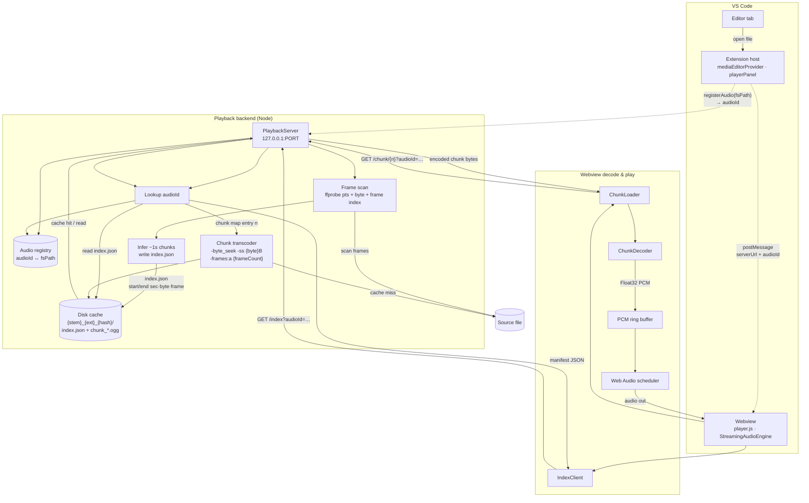
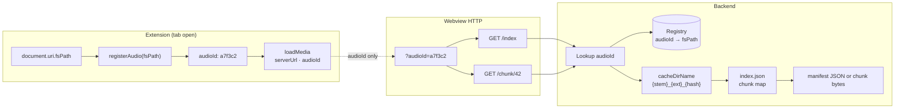
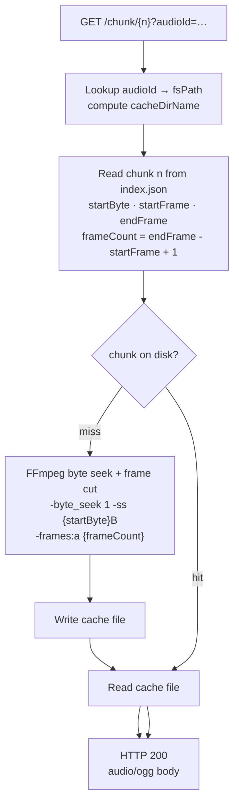
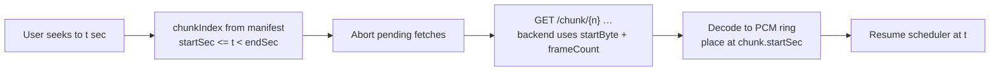
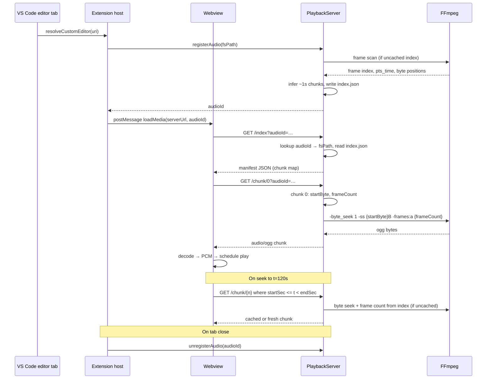

# Streaming playback architecture

This document is the **full refactor spec** for CP's Nice Player playback. The old whole-file pipeline is **removed entirely** — no `GET /audio`, no full-file transcode-before-play, no `AudioEngine` whole-buffer path, no feature flags, no migration period.

Inspired by [CMAF](https://en.wikipedia.org/wiki/Common_Media_Application_Format) (index + fetchable segments), adapted for a **local VS Code extension**: FFmpeg on the host, chunked HTTP, Web Audio in the webview.

**Production:** chunked streaming playback only. See [Backend stack](#backend-stack).

**Docs:** backend and protocol — this file; webview playback — [frontend.md](frontend.md).

## Scope


| In scope                                                                | Out of scope                                                                   |
| ----------------------------------------------------------------------- | ------------------------------------------------------------------------------ |
| Replace backend, extension wiring, and webview playback in one refactor | Legacy full-file playback or dual code paths                                   |
| Chunked stream cache under `globalStorage/stream/`                      | Persistent cache only while server is running (wiped on server start and stop) |
| `audioId` registry, `/index`, `/chunk/{n}`                              | `playback.mode`, `/audio`, `preparePlayback`                                   |


**Definition of done:** no code path remains that transcodes or serves a whole file for playback.

---

## Goals


| Goal                                       | Why                                                                                                                                                                           |
| ------------------------------------------ | ----------------------------------------------------------------------------------------------------------------------------------------------------------------------------- |
| **Fast time-to-first-audio**               | Today we transcode the entire file before any playback URL exists. Users wait on long files even if they only press play or scrub once.                                       |
| **Seek without re-downloading everything** | Today `AudioEngine.load()` fetches `/audio` in one shot and decodes the full file into one `AudioBuffer`. Seeking reuses that buffer (good) but initial load cost is O(file). |
| **Bounded memory in the webview**          | Full-file decode scales with duration × sample rate × channels. Streaming keeps a sliding window of PCM (or encoded chunks) in memory.                                        |
| **Reuse host FFmpeg**                      | Keep transcoding on the extension host; webview only fetches HTTP and decodes.                                                                                                |
| **Cache-friendly**                         | Chunk files should be hash-addressable and reusable on disk; caching is entirely a backend concern.                                                                           |


Non-goals:

- HLS/DASH compatibility with external players
- Network CDN deployment (everything stays `127.0.0.1`)
- Video tracks

---

## Previous architecture (removed)

```
[Media file] → FFmpeg full transcode → [cached .ogg/.flac]
                    ↓
         PlaybackServer GET /audio (whole file)
                    ↓
         Webview fetch → decode full file → AudioBuffer → Web Audio playback
```

**Why it goes away:** prepare blocks on full transcode; load blocks on full fetch + decode; memory scales with file duration.

**Code deleted in this refactor** — see [Full refactor inventory](#full-refactor-inventory).

---

## Target architecture (high level)

See **[Dataflow](#dataflow)** for diagrams. In short:

```
[Media file]
    ↓ extension registers file → audio_id (backend lookup table)
    ↓ extension scans audio frames on file open
[index.json manifest — per-chunk start/end sec, byte, frame]
    ↓ on demand per /chunk/{n} request
[Chunk N] encoded segment (ogg)  ← FFmpeg byte seek + frame count, disk cache internal
    ↓ per chunk in webview
[PCM frames] → ring buffer → Web Audio scheduler
```

**User flow:**

1. User opens a media file in a **VS Code custom editor tab** (`MediaEditorProvider.resolveCustomEditor`). The **extension host** owns this step — not the webview.
2. Extension ensures the playback server is running and calls `**registerAudio(fsPath)`** (internal API); first task is scanning audio frames to build the time/byte map, then receives a short `**audioId**`.
3. Extension posts `loadMedia` with `serverUrl` + `audioId` only.
4. Webview fetches `**GET {serverUrl}/index?audioId=…**`.
5. Backend looks up `audioId` → `fsPath`, loads frame-derived index (or builds it once), returns manifest JSON.
6. Webview requests `**GET {serverUrl}/chunk/{n}?audioId=…**` based on playhead and buffer policy.
7. Backend resolves path from registry, reads chunk `n` from index (`startByte`, `startFrame`, `endFrame`), hits disk cache or transcodes with byte seek + frame count, returns chunk bytes.
8. Webview **decodes each chunk to PCM**, appends to a playable buffer, and drives Web Audio from that window.
9. On tab close / file change, extension calls `**unregisterAudio(audioId)`**.

The frontend only knows `serverUrl`, `audioId`, and chunk numbers. No paths, cache keys, or encoding in URLs.

---

## Dataflow

### Overall pipeline

Solid arrows are data; dashed arrows are control / messaging (no file bytes on the wire).




### Request binding (audio_id registry)

The webview sends a short `audioId` on every request. The backend maintains an in-memory `**audioId ↔ fsPath**` table. Registration happens on tab open (extension only); the webview never sees the path.




| Step       | Who                  | Action                                                  |
| ---------- | -------------------- | ------------------------------------------------------- |
| Register   | Extension (internal) | `registerAudio(fsPath)` → frame scan → `index.json` → `audioId`; store in registry  |
| Index      | Webview              | `GET /index?audioId=…` → lookup → frame-derived index → manifest      |
| Chunk      | Webview              | `GET /chunk/{n}?audioId=…` → lookup → index chunk map → byte seek + frame transcode or cache hit |
| Unregister | Extension on dispose | `unregisterAudio(audioId)` → remove from registry       |


### Chunk path (cache miss vs hit)




### Seek dataflow

On seek, the webview cancels in-flight chunk fetches and reprioritizes around the new playhead. Cached chunks on disk are reused without re-encoding.




---

## Stream manifest format

A minimal “our CMAF” for local audio: **one manifest + many segment files**, no ISO BMFF requirement.

### HTTP API (`audioId` query param)

Base: `http://127.0.0.1:{port}`.


| Method    | Path             | Query param    | Who       | Response                                |
| --------- | ---------------- | -------------- | --------- | --------------------------------------- |
| —         | (internal)       | —              | Extension | `registerAudio(fsPath)` → `{ audioId }` |
| —         | (internal)       | —              | Extension | `unregisterAudio(audioId)`              |
| `GET`     | `/index`         | `audioId={id}` | Webview   | `application/json` manifest             |
| `GET`     | `/chunk/{index}` | `audioId={id}` | Webview   | `audio/ogg` or `audio/flac` bytes       |
| `OPTIONS` | `*`              | —              | Webview   | CORS preflight                          |


**Frontend contract** — only three concepts:

1. `serverUrl` — e.g. `http://127.0.0.1:54321`
2. `audioId` — short opaque id from extension (e.g. `a7f3c2e1`)
3. `chunkIndex` — integer in the URL path

No paths. No cache keys. No URL encoding.

```js
// Webview fetch pattern
const q = `audioId=${audioId}`;

const index = await fetch(`${serverUrl}/index?${q}`);
const chunk = await fetch(`${serverUrl}/chunk/${n}?${q}`);
```

**Backend registry** (`audioRegistry.ts`):

```ts
interface AudioEntry {
  fsPath: string;
  registeredAt: number;
}

// Map<audioId, AudioEntry>
registerAudio(fsPath: string): string   // generates id, stores entry
unregisterAudio(audioId: string): void
resolveAudioId(audioId: string): string // → fsPath or throw 404
```

**Backend contract** — on each webview request:

1. Read `audioId` query param → lookup `fsPath` in registry
2. Compute **cache directory name** `{fileStem}_{sourceExt}_{hash}` (never sent to client)
3. For `/index`: load frame-derived `index.json` (or generate once), return manifest
4. For `/chunk/{n}`: read or generate `{cacheDirName}/chunk_{n}.ogg`, stream bytes

`**audioId` format:** UUID v4 or short random string (e.g. 8–12 hex chars). Opaque to the frontend.

### Index manifest (response body)

```json
{
  "version": 1,
  "durationSec": 247.512,
  "channels": 2,
  "sampleRate": 44100,
  "encode": {
    "format": "ogg",
    "codec": "ogg",
    "contentType": "audio/ogg"
  },
  "chunking": {
    "targetDurationSec": 1.0,
    "count": 248,
    "strategy": "frame-aligned",
    "chunks": [
      { "index": 0, "startSec": 0.0, "endSec": 0.997, "startByte": 0, "endByte": 14321, "startFrame": 0, "endFrame": 45 },
      { "index": 1, "startSec": 0.997, "endSec": 2.005, "startByte": 14322, "endByte": 29210, "startFrame": 46, "endFrame": 92 }
    ]
  }
}
```

Client-facing manifest has **no** `cacheKey` or source path. Chunk URLs are always `{serverUrl}/chunk/{index}?audioId={id}`.

Notes:

- `**initRequired: false`** for v1: each chunk is a **self-contained** encoded snippet decodable with `decodeAudioData` without a shared init segment.
- Optional response headers on chunks: `X-Chunk-Index`, `X-Chunk-Start-Sec`, `X-Chunk-Duration-Sec`.

### Chunk resource

- `GET /chunk/{index}?audioId={id}`
- Response: encoded bytes (`audio/ogg` or `audio/flac`)
- Backend resolves cache internally; client just requests the next index number

### Open media (VS Code tab → extension host)

```
User opens file in editor tab
  → MediaEditorProvider.resolveCustomEditor
  → new MediaPlayerSession(webviewPanel)
  → session.loadMedia(document.uri, ffmpeg)
  → ensure playback server started
  → registerAudio(fsPath) → audioId
  → postMessage({ type: 'loadMedia', serverUrl, audioId, … })
  → webview GET /index?audioId=… then GET /chunk/{n}?audioId=…
  → on dispose: unregisterAudio(audioId)
```

The webview does **not** initiate open-media or registration. It only sends `{ type: 'ready' }` on load so the extension can re-post `loadMedia` if already prepared.

### Request lifecycle


| Step                                 | Who                                    | Work                                                                               |
| ------------------------------------ | -------------------------------------- | ---------------------------------------------------------------------------------- |
| Open media tab                       | Extension                              | `registerAudio` → post `serverUrl` + `audioId` to webview                          |
| Fetch index                          | Webview `GET /index?audioId=…`         | Backend lookup → read frame-derived index (or build once) → manifest                |
| Play / buffer                        | Webview `GET /chunk/{i}?audioId=…`     | Backend lookup → cache hit/miss → bytes                                            |
| Close / replace tab                  | Extension `dispose`                    | `unregisterAudio(audioId)`; abort webview fetches; **disk cache** retained         |
| Same file reopened (same server run) | Extension                              | New `registerAudio` → new `audioId`; on-disk chunks reused via same `cacheDirName` |
| Server stops or restarts             | `PlaybackServer.dispose()` / `start()` | Full `stream/` wipe; next play re-probes and re-transcodes                         |


### `loadMedia` message (extension → webview)

```ts
{
  type: 'loadMedia',
  name: 'track.flac',
  serverUrl: 'http://127.0.0.1:PORT',
  audioId: 'a7f3c2e1',
  debug: {
    fsPath: string,
    playbackFormat: 'ogg' | 'flac',
    playbackOggQuality: number,
    chunkDurationSec: number,
    chunkBufferCount: number,
  },
}
```

No `source`, `playbackUrl`, `transcodedFsPath`, or `transcodedFileName`.

### Errors


| Status | Meaning                                                               |
| ------ | --------------------------------------------------------------------- |
| `400`  | Missing or invalid `audioId` query param                              |
| `404`  | Unknown `audioId`, source file not found, or chunk index out of range |
| `409`  | Chunk generation already in progress (client may retry)               |
| `500`  | FFmpeg / probe failure                                                |
| `503`  | Server disposed / shutting down                                       |


### CORS

Simple `GET` with query params uses only CORS-safelisted headers — **no extra preflight** beyond the existing `OPTIONS` handler. Keep `Access-Control-Allow-Origin: `* as today.

---

## Backend stack

Streaming backend under `src/playback/stream/`. Shared shell: `playbackServer.ts` (CORS + listen + dispatch) and `playbackService.ts`.

| Backend tree | HTTP routes |
|--------------|-------------|
| `stream/` | `GET /index`, `GET /chunk/{n}` |

```
src/playback/
  playbackServer.ts       # CORS, listen, registry + route dispatch
  playbackService.ts
  stream/
    registry.ts
    registrar.ts
    routes.ts
    chunkPlanner.ts, ffmpegChunk.ts, probe.ts, cache.ts, chunk.ts, indexBuilder.ts, resolve.ts
```

Extension wiring: `src/playerPanel/` — `createPlayerSession()` returns `WebviewPlayerSession`. See [frontend.md](frontend.md) for the player tree.

---

## Backend design

### Module layout

### Registration (on tab open, extension-internal)

1. Extension calls `registerAudio(mediaUri.fsPath)`.
2. Server generates new `audioId`, stores `{ fsPath, registeredAt }` in registry.
3. Returns `audioId` to extension for `loadMedia`.

Re-opening the **same file** gets a **new** `audioId` (per tab / per open). Disk chunk cache is still shared via the same **cache directory name** derived from `fsPath`.

### Streaming disk cache (human-readable dirs)

Same root as today:

```
{globalStorage}/stream/
```

Naming helpers live in `cache.ts` (moved from deleted `transcode.ts`): `sanitizeFileStem`, `sanitizeSourceExt`, max 80 chars per segment. **One directory** per source:

```
stream/
  My_Song_flac_{hash}/
    index.json
    chunk_0.ogg
    chunk_1.ogg
    …
    temp_chunk_42.ogg      # during transcode, then rename
```

**Cache directory name** (human-readable prefix — same `{stem}_{ext}_{hash}` pattern the old flat files used, now a directory):

```
{fileStem}_{sourceExt}_{hash}/
```


| Part        | Source                         | Example         |
| ----------- | ------------------------------ | --------------- |
| `fileStem`  | Sanitized basename without ext | `My_Song`       |
| `sourceExt` | Sanitized source extension     | `flac`          |
| `hash`      | sha256 hex (see below)         | `a1b2c3d4e5f6…` |


**Hash payload** — replaces old `computeTranscodeHash`; adds chunk duration:

```
${fsPath}\0${mtimeMs}\0${size}\0${format}\0${oggQuality}\0${chunkDurationSec}
```

Changing source file, encode settings, or chunk duration → new hash → new directory.

**Cache lifecycle:** on every playback server **start and stop**, **wipe the entire `stream/` directory** (all chunk dirs, `index.json` files, and any leftover legacy flat files). Cache is only reused while the server process is running; stopping or restarting the server clears disk cache and forces re-probe and re-transcode on next fetch.

**Chunk files** inside the directory:

```
chunk_{index}.{ogg|flac}     # index = 0, 1, 2, …
temp_chunk_{index}.{ext}     # atomic write pattern (like today's temp_ prefix)
```

**Example** (ogg, 1 s chunks, 248 s track):

```
~/.vscode/globalStorage/…/stream/My_Song_flac_a1b2…/
  index.json
  chunk_0.ogg
  chunk_1.ogg
  …
  chunk_247.ogg
```

**Layout** (only format — no legacy flat files):

```
stream/
  My_Song_flac_{hash}/
    index.json
    chunk_0.ogg
    chunk_1.ogg
```

### Server lifecycle cleanup

When `PlaybackServer.start()` or `PlaybackServer.dispose()` runs (sync `cleanStreamCacheDir()` — completes before `dispose()` returns):

1. Delete **everything** under `{globalStorage}/stream/` — chunk directories, `index.json`, and any orphaned files.
2. Recreate empty `stream/`.

Not a legacy-only sweep; the stream directory is **always empty** while the server is not running, and at server start. Chunks written during an active session are reused until the server stops or restarts.

### Index creation (frame scan first)

1. Read `audioId` query param → lookup `fsPath` in registry.
2. Compute `cacheDirName` = `{fileStem}_{sourceExt}_{hash}` via `cache.ts`.
3. If `{transcodeDir}/{cacheDirName}/index.json` exists and is valid → return it.
4. Else scan audio frames once (ffprobe packet/frame listing), collecting frame index, `pts_time`, and byte position.
5. Infer chunk boundaries with target length ~1.0 s by snapping to nearest valid frame boundary.
6. Build manifest with per-chunk `{startSec, endSec, startByte, endByte, startFrame, endFrame}`, write `index.json`, return JSON.

Target: index ready quickly after open; frame scan cost is paid once per source and then reused.

### Chunk generation

**v1 strategy: on-demand FFmpeg slice using byte seek + frame count from index** (required for late scrub — chunk 120 must not decode 120 s first):

```bash
ffmpeg -nostats -loglevel quiet \
  -byte_seek 1 -ss {startByte}B -i {input} \
  -frames:a {frameCount} \
  -vn -c:a libopus -b:a 128k -f ogg pipe:1
```

| Flag / order | Why |
|--------------|-----|
| `-byte_seek 1` + `-ss {startByte}B` | Start decode from indexed physical byte position instead of time seek |
| `-frames:a {frameCount}` | Hard output cutoff by frame count; does not rely on `-t` timing behavior |
| `-f ogg pipe:1` | Stream chunk bytes directly for HTTP response without temp output target requirement |

Implemented in `stream/ffmpegChunk.ts` (`transcodeChunk`).

**Join policy (v1):** use **mandatory micro-crossfade** in the scheduler at chunk boundaries (default 5 ms, configurable 2-10 ms) to mask splice discontinuities from independently encoded chunk files.

- `startByte`, `startFrame`, `endFrame` come from `index.json` chunk map
- `frameCount = endFrame - startFrame + 1`
- `startSec`, `endSec` remain metadata for seek mapping and scheduler timing
- Write to: `{transcodeDir}/{cacheDirName}/chunk_{index}.ogg`
- If file exists, stream from disk (cache hit)

**v2 optimization:** background prefetch on host: after chunk `i` is requested, optionally warm remaining chunks in the current buffer window without blocking the HTTP response.

**Alternative (not v1):** FFmpeg segment muxer upfront (`-f segment`) — faster sequential playback but defeats “index first, chunks lazy”.

### Concurrency

- Webview: one chunk HTTP fetch at a time (sequential low-to-high within the buffer window).
- Server: one FFmpeg transcode at a time via a serial mutex; `chunkInFlight` dedupes duplicate requests for the same chunk.
- Multiple tabs on the same file may have different `audioId`s but share disk cache via the same `cacheDirName`.

### Config additions

```json
"cp-nice-player.playback.chunkDurationSec": { "default": 1, "minimum": 0.5, "maximum": 10 }
"cp-nice-player.playback.chunkBufferCount": {
  "default": 5,
  "description": "Number of chunks to buffer from the playhead, including the current chunk. Example: count 5 at chunk 10 → chunks 10–14."
}
"cp-nice-player.playback.crossfadeMs": { "default": 20, "minimum": 0, "maximum": 500 }
"cp-nice-player.playback.debugLogging": { "default": false }
```

`**chunkBufferCount**` — chunk count in the forward buffer, **including the current chunk**. Default **5** with frame-aligned ~1 s chunks (time window is approximately 5 s from the playhead).

Keep existing `playback.format` and `playback.oggQuality`.

### Full refactor inventory

Every legacy playback artifact is **deleted or rewritten** — not deprecated behind a flag.

#### Delete outright


| File / symbol                                        | Reason                                                                 |
| ---------------------------------------------------- | ---------------------------------------------------------------------- |
| `src/playback/transcode.ts`                          | Whole-file `ensureTranscodedAudio`, `getTranscodeFileName`, flat cache |
| `media/audioEngine.js`                               | Whole-file `load()` → single `AudioBuffer`                             |
| `PlaybackServer.preparePlayback()`                   | Blocking full-file prepare                                             |
| `PlaybackServer.getPlaybackUrl()`                    | `GET /audio` URL                                                       |
| `PlaybackServer.handleAudioRoute()`                  | Whole-file HTTP route                                                  |
| `PlaybackServer.preparedFilePath` / `preparedFormat` | Single-slot legacy state                                               |
| `PlaybackResult` interface                           | `playbackUrl`, `transcodedFsPath`, …                                   |
| `ffmpeg.transcodeForPlayback()`                      | Full-file FFmpeg one-shot                                              |
| `playerPanel.PreparedPlayback`                       | Whole-file prepare result                                              |
| `playerPanel.prepareAndPlay()` transcode wait        | Replace with `registerAudio` only                                      |
| `LoadMediaMessage.source`                            | Was `playbackUrl`                                                      |
| `transcodeStatus` webview messages                   | Replace with `streamStatus` (index / chunk progress)                   |


#### Rewrite in place


| File                | Change                                                                                |
| ------------------- | ------------------------------------------------------------------------------------- |
| `playbackServer.ts` | Routes `/index`, `/chunk/:n`; expose `registerAudio` / `unregisterAudio` to extension |
| `playerPanel.ts`    | `loadMedia` → server start + register + post `{ serverUrl, audioId }`                 |
| `player.js`         | `StreamingAudioEngine`; handle `streamStatus`; debug fields for buffer window         |
| `player.html`       | Load `streamingAudioEngine.js`                                                        |
| `package.json`      | Description: chunked streaming playback                                               |


#### Extract then delete

From `transcode.ts` → `cache.ts`:

- `sanitizeFileStem`, `sanitizeSourceExt`, `getTranscodeDir` (rename `getStreamCacheDir`)
- `computeTranscodeHash` → `computeStreamCacheHash` (add `chunkDurationSec` to payload)
- `cleanStreamCacheDir()` — sync; called from `PlaybackServer.start()` and `dispose()`; deletes and recreates entire `stream/`

From `audioEngine.js` → `streamingAudioEngine.js`:

- Per-chunk decode via `decodeAudioData` only
- Replace `load(url)` with `load(serverUrl, audioId)` → index + chunk pipeline

#### Unchanged role (not legacy)


| File                     | Keeps                                                         |
| ------------------------ | ------------------------------------------------------------- |
| `playbackService.ts`     | Server lifecycle                                              |
| `mediaEditorProvider.ts` | Tab open → `loadMedia` (caller unchanged)                     |
| `src/ffmpegHost.ts`      | `checkFfmpegAvailable`, host notifications                    |
| `stream/ffmpegChunk.ts` | Per-chunk transcode (`transcodeChunk`)              |
| `config.ts`              | `playback.format`, `playback.oggQuality` + new chunk settings |


---

## Frontend design

The webview (`player.js` + `streamingAudioEngine.js`) fetches the index and chunks over HTTP, decodes each chunk to PCM, and drives Web Audio output. It only knows `serverUrl`, `audioId`, and chunk numbers — see [Dataflow](#dataflow).

**Full spec:** [frontend.md](frontend.md) (schedulers, ring buffer, VS Code webview CSP, state machine).

### Pipeline

```
loadMedia(serverUrl, audioId)
  → GET /index → manifest
  → GET /chunk/{n} (window around playhead)
  → decode chunk → PCM
  → scheduler → speakers
```

### Components (`StreamingAudioEngine`)


| Component | Role |
| --- | --- |
| **IndexClient** | Fetch manifest; chunk map with `startSec` / `endSec` |
| **ChunkLoader** | Buffer `[playhead … playhead + chunkBufferCount − 1]`; abort on seek |
| **ChunkDecoder** | `decodeAudioData` → `AudioBuffer` per chunk |
| **Scheduler** | PCM → continuous output (see below) |

### Schedulers


| | Option A (reference) | Option B (production) |
| --- | --- | --- |
| **Mechanism** | Chain `AudioBufferSourceNode` on `nextPlayTime` | `AudioWorklet` pulls from ring buffer every ~128 frames |
| **Files** | — | `streamingAudioEngine.js`, `pcmRing.js`, `pcmWorkletProcessor.js`, `workletScheduler.js` |
| **Trade-off** | Simple; no worklet CSP | One output node; pull-based clock in production player |

Production playback uses Option B: `WorkletScheduler.writePcm()` keeps the ring stocked; the audio thread fills output buffers in `process()`. Details: [frontend.md — Scheduler options](frontend.md#scheduler-options).

### Buffer policy (summary)

- **Forward:** `chunkBufferCount` chunks from playhead (default 5 ≈ 5 s at 1 s/chunk).
- **Behind:** ~2 chunks retained for quick rewind.
- **Seek:** cancel fetches, reset buffer/scheduler, refill from seek chunk.
- **Join:** configurable crossfade between adjacent chunks (default `20` ms via `playback.crossfadeMs`; WSOLA-aligned linear blend in the webview).

### UI (`player.js`)

- Controls wired to `StreamingAudioEngine` (play, pause, seek, volume).
- Event log: `fetch` and `decode` lines when each chunk finishes; debug grid shows buffer, chunk, and ring state.

---

## End-to-end sequence




---

## Refactor checklist

Single pass — ship only when legacy paths are gone.

### Planning (this doc)

- Goals, API, cache layout — this file; buffer policy and schedulers — [frontend.md](frontend.md)
- Chunk strategy: **frame-aligned ~1 s chunks inferred from scanned frame times**; `chunkBufferCount`: **5**
- Stream-only: **no legacy code paths**
- Ogg vs FLAC default for streaming

### Backend

- `audioRegistry.ts`, `probe.ts`, `cache.ts`, `resolve.ts`, `indexBuilder.ts`, `chunk.ts`
- `playbackServer.ts` — `/index`, `/chunk/:n`, `registerAudio`, `unregisterAudio`
- **Delete** `preparePlayback`, `GET /audio`, `preparedFilePath`, `PlaybackResult`
- **Delete** `transcode.ts`; **delete** `ffmpeg.transcodeForPlayback`
- Add `stream/ffmpegChunk.transcodeChunk` (segment slice)
- Sync `cleanStreamCacheDir()` on `PlaybackServer.start()` and `dispose()` — wipe entire `stream/`
- Manual test: register → `curl '…/index?audioId=…'` → `curl '…/chunk/0?audioId=…'`

### Extension + webview

- `playerPanel.ts` — `registerAudio` / `unregisterAudio`; new `loadMedia` shape
- **Delete** `prepareAndPlay` transcode wait, `PreparedPlayback`, `transcodeStatus`
- `streamingAudioEngine.js` — index + chunk loader + `WorkletScheduler` play / pause / seek (Option B)
- `player.js` + `player.html` — wire engine, worklet CSP/meta, and `streamStatus`
- Grep confirms zero references: `preparePlayback`, `ensureTranscodedAudio`, `/audio`, `AudioEngine`, `transcodeForPlayback`

### Polish

- Host background prefetch within `chunkBufferCount` window (optional)
- Chunk crossfade (5 ms) in worklet or main thread
- Update `package.json` description and README

---

## Design decisions (recommendations)


| Topic                 | Recommendation                                         | Rationale                                                                  |
| --------------------- | ------------------------------------------------------ | -------------------------------------------------------------------------- |
| Chunk duration        | **~1 s target, frame-aligned**                         | Matches real frame timing while keeping seek/scrub responsive               |
| Open media trigger    | **VS Code editor tab**                                 | Extension registers file → posts `serverUrl` + `audioId`                   |
| API shape             | `**/index` + `/chunk/{n}` + `?audioId=`**              | Clean URLs; backend owns path lookup and disk cache                        |
| Audio identity        | `**audioId` registry**                                 | Extension registers path; webview only sees opaque id                      |
| Cache dir naming      | `**{fileStem}_{sourceExt}_{hash}/`**                   | Human-readable; hash includes chunking strategy and target duration          |
| Cache lifetime        | **Session-scoped (server process)**                    | Full `stream/` wipe on server start and stop; reuse only while server runs |
| Playback buffer       | `**chunkBufferCount`** (default 5)                     | Includes current chunk; playing 10 → hold 10–14                            |
| Playback              | **Stream only (full refactor)**                        | Delete legacy modules; no dual paths                                       |
| Chunk encoding        | **Same as today** (ogg/flac)                           | Reuse FFmpeg settings; webview decodes with `decodeAudioData`              |
| Self-contained chunks | **Yes (v1)**                                           | Avoid init-segment complexity in webview                                   |
| Index transport       | **JSON over HTTP**                                     | Easy to debug in VS Code webview                                           |
| Probe tool            | **ffprobe**                                            | Accurate duration; falls back to ffmpeg stderr parse                       |
| PCM output            | **Float32, interleaved channels in ring**              | Matches `AudioBuffer` channel layout                                       |
| Scheduler             | **Option B** — `WorkletScheduler` + `AudioWorklet` ring | One output node; pull-based clock; CSP validated in webview |
| Chunk FFmpeg          | **`-byte_seek 1`, `-ss {startByte}B`, `-frames:a {frameCount}`** | Byte-accurate chunk entry + frame-count bounded chunk exit               |
| Chunk join strategy   | **Always-on 5 ms crossfade**                           | Masks splice pops from independently encoded chunks                        |


---

## Risks and mitigations


| Risk                                       | Mitigation                                                                                          |
| ------------------------------------------ | --------------------------------------------------------------------------------------------------- |
| Rapid scrubbing spawns many FFmpeg jobs    | Per-chunk promise dedupe + global concurrency cap; 1 s chunks mean finer-grained cache hits on seek |
| Chunk boundary clicks/pops                 | Byte/frame-bounded chunk cuts + always-on 5 ms crossfade; tune 2-10 ms if needed                    |
| Slow seek on late chunks                   | Use indexed byte seek (`-byte_seek 1`, `-ss {startByte}B`) to avoid linear time-based decode paths  |
| VS Code webview CSP blocks localhost       | Already fetching `127.0.0.1` today — keep same pattern                                              |
| VS Code webview AudioWorklet               | Fetch+blob `addModule`, meta tag for module URL, CSP `blob:`/`worker-src`/`connect-src` — apply in `player.html` on integration |
| Ring buffer overrun (Option B)             | `writeBlock` caps at `freeFrames`; main thread waits on `writeAck` before next write                |
| Stale `audioId` after unregister           | `404` on fetch; webview shows error; extension re-registers on new open                             |
| Registry memory growth                     | `unregisterAudio` on tab dispose; optional TTL for orphaned ids                                     |
| Last chunk shorter than `chunkDurationSec` | Manifest lists exact `durationSec`; decoder uses actual decoded length                              |
| Very short files (< 1 chunk)               | `count = 1`, single chunk transcode                                                                 |


---

## Open questions

1. **Ogg vs FLAC for streaming** — Ogg smaller/faster transcode; FLAC better for quality. Keep user setting?
2. ~~**AudioWorklet vs chained BufferSource**~~ — **Resolved:** production player = Option B (`WorkletScheduler` in `streamingAudioEngine.js`); see [frontend.md — Option B](frontend.md#option-b-audioworklet--ring-buffer-production)
3. **Progress UX** — Show “Buffering chunk N/M” or only spinner until first audible chunk?

---

## Success criteria

- **No legacy playback code** — `rg` finds no `preparePlayback`, `ensureTranscodedAudio`, `GET /audio`, `transcodeForPlayback`, or whole-file `AudioEngine.load`
- Index without full-file transcode; playable within **~1–3 s** of tab open (probe + first chunk + decode)
- Seek fetches **O(1)** chunks, not whole file
- Webview memory **bounded** by `chunkBufferCount` window
- Same server run: reopened file reuses `{cacheDirName}/chunk_`* without re-encoding
- Server start/stop: `stream/` is empty when server is not running; no stale chunk dirs or legacy files left

---

## References

- Tab open: `src/mediaEditorProvider.ts` → `src/playerPanel/index.ts` (`createPlayerSession`)
- Webview playback: [frontend.md](frontend.md) — `media/player/`
- CMAF: [ISO/IEC 23000-19](https://www.iso.org/standard/71975.html) (manifest + segments); this project is a local simplification
- **Removed by this refactor:** `playbackServer.ts` `/audio` path, `transcode.ts`, `audioEngine.js`

