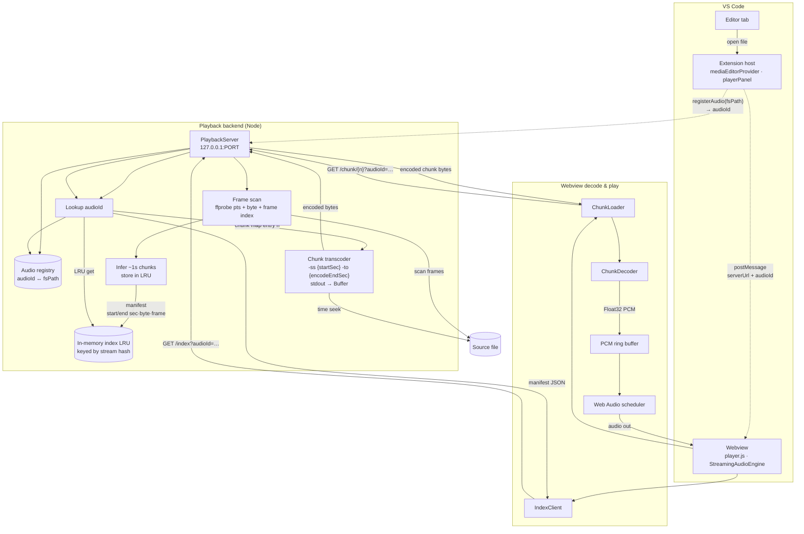
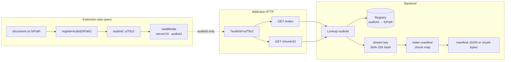
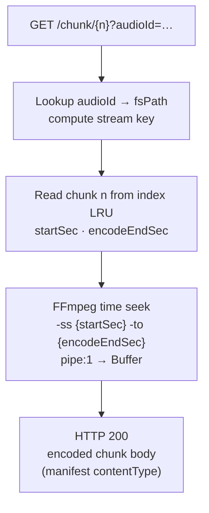
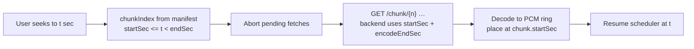
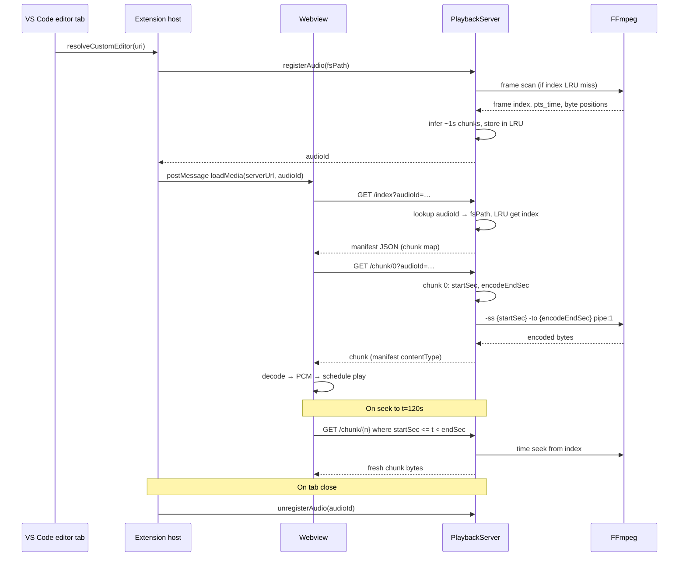

# Streaming playback architecture

This document is the **full refactor spec** for CP's Nice Player playback. The old whole-file pipeline is **removed entirely** — no `GET /audio`, no full-file transcode-before-play, no `AudioEngine` whole-buffer path, no feature flags, no migration period.

Inspired by [CMAF](https://en.wikipedia.org/wiki/Common_Media_Application_Format) (index + fetchable segments), adapted for a **local VS Code extension**: FFmpeg on the host, chunked HTTP, Web Audio in the webview.

**Production:** chunked streaming playback only. See [Backend stack](#backend-stack).

**Docs:** backend and protocol — this file; webview playback — [frontend.md](frontend.md).

## Scope


| In scope                                                                | Out of scope                                                                   |
| ----------------------------------------------------------------------- | ------------------------------------------------------------------------------ |
| Replace backend, extension wiring, and webview playback in one refactor | Legacy full-file playback or dual code paths                                   |
| Chunked streaming with in-memory index memoization                      | Persistent disk cache under `globalStorage/stream/`                            |
| `audioId` registry, `/index`, `/chunk/{n}`                              | `playback.mode`, `/audio`, `preparePlayback`                                   |


**Definition of done:** no code path remains that transcodes or serves a whole file for playback.

---

## Goals


| Goal                                       | Why                                                                                                                                                                           |
| ------------------------------------------ | ----------------------------------------------------------------------------------------------------------------------------------------------------------------------------- |
| **Fast time-to-first-audio**               | Today we transcode the entire file before any playback URL exists. Users wait on long files even if they only press play or scrub once.                                       |
| **Seek without re-downloading everything** | Today `AudioEngine.load()` fetches `/audio` in one shot and decodes the full file into one `AudioBuffer`. Seeking reuses that buffer (good) but initial load cost is O(file). |
| **Bounded memory in the webview**          | Full-file decode scales with duration × sample rate × channels. Streaming keeps a sliding window of PCM (or encoded chunks) in memory.                                        |
| **Reuse host FFmpeg**                      | Keep transcoding on the extension host; webview only fetches HTTP and decodes.                                                                                                |
| **In-memory index memoization**          | Frame scan is expensive; index manifests are cached in a bounded LRU for the playback server session. Chunks are transcoded on the fly per request. |


Non-goals:

- HLS/DASH compatibility with external players
- Network CDN deployment (everything stays `127.0.0.1`)
- Video tracks

---

## Previous architecture (removed)

```
[Media file] → FFmpeg full transcode → [cached .ogg/.flac]
                    ↓
         PlaybackServer GET /audio (whole file)
                    ↓
         Webview fetch → decode full file → AudioBuffer → Web Audio playback
```

**Why it goes away:** prepare blocks on full transcode; load blocks on full fetch + decode; memory scales with file duration.

**Code deleted in this refactor** — see [Full refactor inventory](#full-refactor-inventory).

---

## Target architecture (high level)

See **[Dataflow](#dataflow)** for diagrams. In short:

```
[Media file]
    ↓ extension registers file → audio_id (backend lookup table)
    ↓ extension scans audio frames on file open
[index manifest — per-chunk start/end sec, byte, frame]  ← in-memory LRU, keyed by stream hash
    ↓ on demand per /chunk/{n} request
[Chunk N] encoded segment (ogg/mp3/flac/wav)  ← FFmpeg time seek, stdout → Buffer (no disk)
    ↓ per chunk in webview
[PCM frames] → ring buffer → Web Audio scheduler
```

**User flow:**

1. User opens a media file in a **VS Code custom editor tab** (`MediaEditorProvider.resolveCustomEditor`). The **extension host** owns this step — not the webview.
2. Extension ensures the playback server is running and calls `**registerAudio(fsPath)`** (internal API); first task is scanning audio frames to build the time/byte map, then receives a short `**audioId**`.
3. Extension posts `loadMedia` with `serverUrl` + `audioId` only.
4. Webview fetches `**GET {serverUrl}/index?audioId=…**`.
5. Backend looks up `audioId` → `fsPath`, loads frame-derived index (or builds it once), returns manifest JSON.
6. Webview requests `**GET {serverUrl}/chunk/{n}?audioId=…**` based on playhead and buffer policy.
7. Backend resolves path from registry, reads chunk `n` from index, transcodes with time seek via FFmpeg stdout, returns chunk bytes.
8. Webview **decodes each chunk to PCM**, appends to a playable buffer, and drives Web Audio from that window.
9. On tab close / file change, extension calls `**unregisterAudio(audioId)`**.

The frontend only knows `serverUrl`, `audioId`, and chunk numbers. No paths or encoding in URLs.

---

## Dataflow

### Overall pipeline

Solid arrows are data; dashed arrows are control / messaging (no file bytes on the wire).


```mermaid
flowchart TB
  subgraph vscode ["VS Code"]
    Tab["Editor tab"]
    Ext["Extension host\nmediaEditorProvider · playerPanel"]
    UI["Webview\nplayer.js · StreamingAudioEngine"]
  end

  subgraph backend ["Playback backend (Node)"]
    Srv["PlaybackServer\n127.0.0.1:PORT"]
    Reg[("Audio registry\naudioId ↔ fsPath")]
    Resolve["Lookup audioId"]
    FrameScan["Frame scan\nffprobe pts + byte + frame index"]
    IndexBuild["Infer ~1s chunks\nstore in LRU"]
    ChunkGen["Chunk transcoder\n-ss {startSec} -to {encodeEndSec}\nstdout → Buffer"]
    IndexMem[("In-memory index LRU\nkeyed by stream hash")]
  end

  subgraph decode ["Webview decode & play"]
    Idx["IndexClient"]
    Loader["ChunkLoader"]
    Dec["ChunkDecoder"]
    Ring["PCM ring buffer"]
    WA["Web Audio scheduler"]
  end

  File[("Source file")]

  Tab -->|"open file"| Ext
  Ext -.->|"registerAudio(fsPath)\n→ audioId"| Srv
  Srv --> Reg
  Srv --> FrameScan
  FrameScan -->|"scan frames"| File
  FrameScan --> IndexBuild
  IndexBuild -->|"manifest\nstart/end sec·byte·frame"| IndexMem
  Ext -.->|"postMessage\nserverUrl + audioId"| UI

  UI --> Idx
  Idx -->|"GET /index?audioId=…"| Srv
  Srv --> Resolve
  Resolve --> Reg
  Resolve -->|"LRU get"| IndexMem
  Resolve -->|"manifest JSON"| Idx

  UI --> Loader
  Loader -->|"GET /chunk/{n}?audioId=…"| Srv
  Srv --> Resolve
  Resolve -->|"chunk map entry n"| ChunkGen
  ChunkGen -->|"time seek"| File
  ChunkGen -->|"encoded bytes"| Srv
  Srv -->|"encoded chunk bytes"| Loader

  Loader --> Dec
  Dec -->|"Float32 PCM"| Ring
  Ring --> WA
  WA -->|"audio out"| UI
```


### Request binding (audio_id registry)

The webview sends a short `audioId` on every request. The backend maintains an in-memory `**audioId ↔ fsPath**` table. Registration happens on tab open (extension only); the webview never sees the path.


```mermaid
flowchart LR
  subgraph ext ["Extension (tab open)"]
    URI["document.uri.fsPath"]
    REG["registerAudio(fsPath)"]
    ID["audioId: a7f3c2"]
    LM["loadMedia\nserverUrl · audioId"]
    URI --> REG --> ID --> LM
  end

  subgraph http ["Webview HTTP"]
    Q["?audioId=a7f3c2"]
    IDX["GET /index"]
    CHK["GET /chunk/42"]
    Q --> IDX
    Q --> CHK
  end

  subgraph srv ["Backend"]
    MAP[("Registry\naudioId → fsPath")]
    R["Lookup audioId"]
    CK["stream key\nSHA-256 hash"]
    IDXJ["index manifest\nchunk map"]
    OUT["manifest JSON or chunk bytes"]
    R --> MAP
    R --> CK --> IDXJ --> OUT
  end

  LM -.->|"audioId only"| Q
  IDX --> R
  CHK --> R
```


| Step       | Who                  | Action                                                  |
| ---------- | -------------------- | ------------------------------------------------------- |
| Register   | Extension (internal) | `registerAudio(fsPath)` → frame scan → index manifest → `audioId`; store in registry  |
| Index      | Webview              | `GET /index?audioId=…` → lookup → frame-derived index → manifest      |
| Chunk      | Webview              | `GET /chunk/{n}?audioId=…` → lookup → index chunk map → time seek + transcode to Buffer |
| Unregister | Extension on dispose | `unregisterAudio(audioId)` → remove from registry       |


### Chunk path (on-the-fly transcode)


```mermaid
flowchart TD
  REQ["GET /chunk/{n}?audioId=…"]
  RESOLVE["Lookup audioId → fsPath\ncompute stream key"]
  INDEX["Read chunk n from index LRU\nstartSec · encodeEndSec"]
  FF["FFmpeg time seek\n-ss {startSec} -to {encodeEndSec}\npipe:1 → Buffer"]
  RESP["HTTP 200\nencoded chunk body\n(manifest contentType)"]

  REQ --> RESOLVE --> INDEX --> FF --> RESP
```


### Seek dataflow

On seek, the webview cancels in-flight chunk fetches and reprioritizes around the new playhead. Each chunk request transcodes fresh via FFmpeg stdout.


```mermaid
flowchart LR
  Seek["User seeks to t sec"]
  Calc["chunkIndex from manifest\nstartSec <= t < endSec"]
  Abort["Abort pending fetches"]
  Fetch["GET /chunk/{n} …\nbackend uses startSec + encodeEndSec"]
  Decode["Decode to PCM ring\nplace at chunk.startSec"]
  Play["Resume scheduler at t"]

  Seek --> Calc --> Abort --> Fetch --> Decode --> Play
```


---

## Stream manifest format

A minimal “our CMAF” for local audio: **one manifest + many segment files**, no ISO BMFF requirement.

### HTTP API (`audioId` query param)

Base: `http://127.0.0.1:{port}`.


| Method    | Path             | Query param    | Who       | Response                                |
| --------- | ---------------- | -------------- | --------- | --------------------------------------- |
| —         | (internal)       | —              | Extension | `registerAudio(fsPath)` → `{ audioId }` |
| —         | (internal)       | —              | Extension | `unregisterAudio(audioId)`              |
| `GET`     | `/index`         | `audioId={id}` | Webview   | `application/json` manifest             |
| `GET`     | `/chunk/{index}` | `audioId={id}` | Webview   | Encoded chunk bytes (`Content-Type` from manifest `encode.contentType`: `audio/ogg`, `audio/flac`, `audio/mpeg`, or `audio/wav`) |
| `GET`     | `/health`        | —              | Extension host, webview | `{ ok, registeredAudioCount, encodeFormat, ffmpegAvailable }` |
| `OPTIONS` | `*`              | —              | Webview   | CORS preflight                          |


**Frontend contract** — only three concepts:

1. `serverUrl` — e.g. `http://127.0.0.1:54321`
2. `audioId` — short opaque id from extension (e.g. `a7f3c2e1`)
3. `chunkIndex` — integer in the URL path

No paths. No URL encoding.

```js
// Webview fetch pattern
const q = `audioId=${audioId}`;

const index = await fetch(`${serverUrl}/index?${q}`);
const chunk = await fetch(`${serverUrl}/chunk/${n}?${q}`);
```

**Backend registry** (`audioRegistry.ts`):

```ts
interface AudioEntry {
  fsPath: string;
  registeredAt: number;
}

// Map<audioId, AudioEntry>
registerAudio(fsPath: string): string   // generates id, stores entry
unregisterAudio(audioId: string): void
resolveAudioId(audioId: string): string // → fsPath or throw 404
```

**Backend contract** — on each webview request:

1. Read `audioId` query param → lookup `fsPath` in registry
2. Compute **stream key** from file metadata and encode settings (never sent to client)
3. For `/index`: load frame-derived manifest from LRU (or build once), return JSON
4. For `/chunk/{n}`: transcode chunk on the fly via FFmpeg stdout, stream bytes

**`/health` is deliberately outside that contract** — no `audioId`, no registry lookup, and no
ffmpeg requirement (it reads only the cached ffmpeg probe, so the response is synchronous). It
answers exactly one question: *is this server accepting and answering requests?* The extension
host calls it against `127.0.0.1` in `PlaybackServer.probeSelf()`, which is what lets the player
distinguish a dead server from one it merely cannot reach — see
[Server status reporting](frontend.md#server-status-reporting).

`**audioId` format:** UUID v4 or short random string (e.g. 8–12 hex chars). Opaque to the frontend.

### Index manifest (response body)

```json
{
  "version": 1,
  "durationSec": 247.512,
  "channels": 2,
  "sampleRate": 44100,
  "encode": {
    "format": "ogg",
    "codec": "libvorbis",
    "contentType": "audio/ogg"
  },
  "chunking": {
    "targetDurationSec": 1.0,
    "count": 248,
    "strategy": "frame-aligned",
    "chunks": [
      { "index": 0, "startSec": 0.0, "endSec": 0.997, "startByte": 0, "endByte": 14321, "startFrame": 0, "endFrame": 45 },
      { "index": 1, "startSec": 0.997, "endSec": 2.005, "startByte": 14322, "endByte": 29210, "startFrame": 46, "endFrame": 92 }
    ]
  }
}
```

Client-facing manifest has **no** source path. Chunk URLs are always `{serverUrl}/chunk/{index}?audioId={id}`.

Notes:

- `**initRequired: false`** for v1: each chunk is a **self-contained** encoded snippet decodable with `decodeAudioData` without a shared init segment.
- `encode.*` reflects the **effective** encode format after FFmpeg encoder probing (see [Encode format resolution](#encode-format-resolution)), not necessarily the user’s `playback.format` preference. Examples when fallback applies: `{ "format": "mp3", "codec": "libmp3lame", "contentType": "audio/mpeg" }` or `{ "format": "wav", "codec": "pcm_s16le", "contentType": "audio/wav" }`.
- Optional response headers on chunks: `X-Chunk-Index`, `X-Chunk-Start-Sec`, `X-Chunk-Duration-Sec`.

### Chunk resource

- `GET /chunk/{index}?audioId={id}`
- Response: encoded bytes; `Content-Type` matches manifest `encode.contentType`
- Backend resolves path internally; client just requests the next index number

### Open media (VS Code tab → extension host)

```
User opens file in editor tab
  → MediaEditorProvider.resolveCustomEditor
  → new MediaPlayerSession(webviewPanel)
  → session.loadMedia(document.uri, ffmpeg)
  → ensure playback server started
  → registerAudio(fsPath) → audioId
  → postMessage({ type: 'loadMedia', serverUrl, audioId, … })
  → webview GET /index?audioId=… then GET /chunk/{n}?audioId=…
  → on dispose: unregisterAudio(audioId)
```

The webview does **not** initiate open-media or registration. It only sends `{ type: 'ready' }` on load so the extension can re-post `loadMedia` if already prepared.

### Request lifecycle


| Step                                 | Who                                    | Work                                                                               |
| ------------------------------------ | -------------------------------------- | ---------------------------------------------------------------------------------- |
| Open media tab                       | Extension                              | `registerAudio` → post `serverUrl` + `audioId` to webview                          |
| Fetch index                          | Webview `GET /index?audioId=…`         | Backend lookup → read frame-derived index (or build once) → manifest                |
| Play / buffer                        | Webview `GET /chunk/{i}?audioId=…`     | Backend lookup → transcode → bytes                                            |
| Close / replace tab                  | Extension `dispose`                    | `unregisterAudio(audioId)`; abort webview fetches; in-memory index retained         |
| Same file reopened (same server run) | Extension                              | New `registerAudio` → new `audioId`; index LRU hit via same stream key |
| Server stops or restarts             | `PlaybackServer.dispose()` / `start()` | `clearStreamIndexCache()`; next play re-probes frame scan                         |


### `loadMedia` message (extension → webview)

```ts
{
  type: 'loadMedia',
  name: 'track.flac',
  serverUrl: 'http://127.0.0.1:PORT',
  audioId: 'a7f3c2e1',
  debug: {
    fsPath: string,
    playbackFormat: 'ogg' | 'mp3' | 'flac' | 'wav',  // effective encode format (see Encode format resolution)
    playbackOggQuality: number,
    chunkDurationSec: number,
    prefetchChunks: number,
    maxCachedChunks: number,
  },
}
```

`debug.playbackFormat` is `getEffectiveEncodeFormat()` — the resolved runtime format, which may differ from the `playback.format` setting when FFmpeg lacks the preferred encoder.

No `source`, `playbackUrl`, `transcodedFsPath`, or `transcodedFileName`.

### Errors


| Status | Meaning                                                               |
| ------ | --------------------------------------------------------------------- |
| `400`  | Missing or invalid `audioId` query param                              |
| `404`  | Unknown `audioId`, source file not found, or chunk index out of range |
| `409`  | Chunk generation already in progress (client may retry)               |
| `500`  | FFmpeg / probe failure                                                |
| `503`  | Server disposed / shutting down                                       |


### CORS

Simple `GET` with query params uses only CORS-safelisted headers — **no extra preflight** beyond the existing `OPTIONS` handler. Keep `Access-Control-Allow-Origin: `* as today.

---

## Backend stack

Streaming backend under `src/playback/stream/`. Shared shell: `playbackServer.ts` (CORS + listen + dispatch) and `playbackService.ts`.

| Backend tree | HTTP routes |
|--------------|-------------|
| `stream/` | `GET /index`, `GET /chunk/{n}` |

```
src/
  encodeFormat.ts         # preference → effective encode format (fallback chain)
  ffmpegHost.ts           # FFmpeg probe, encoder capabilities, getEffectiveEncodeFormat
  playback/
    playbackServer.ts     # CORS, listen, registry + route dispatch
    playbackService.ts
    stream/
      registry.ts
      registrar.ts
      routes.ts
      chunkPlanner.ts, ffmpegChunk.ts, probe.ts, streamKey.ts, chunk.ts, indexBuilder.ts, resolve.ts
```

Extension wiring: `src/playerPanel/` — `createPlayerSession()` returns `WebviewPlayerSession`. See [frontend.md](frontend.md) for the player tree.

---

## Backend design

### Module layout

### Registration (on tab open, extension-internal)

1. Extension calls `registerAudio(mediaUri.fsPath)`.
2. Server generates new `audioId`, stores `{ fsPath, registeredAt }` in registry.
3. Returns `audioId` to extension for `loadMedia`.

Re-opening the **same file** gets a **new** `audioId` (per tab / per open). In-memory index manifests are shared via the same **stream key** derived from `fsPath` and encode settings.

### Encode format resolution

User setting `playback.format` is a **preference** (`ogg` or `flac`). At FFmpeg startup the extension probes installed encoders (`ffmpeg -encoders`) and resolves an **effective** encode format (`EncodeFormat`: `ogg` | `mp3` | `flac` | `wav`). Resolution lives in `src/encodeFormat.ts`; caching and probing in `src/ffmpegHost.ts`.

| Preference (`playback.format`) | Primary (encoder available) | Fallback (encoder missing) |
| ------------------------------ | ----------------------------- | -------------------------- |
| `ogg` (default)                | `ogg` (libvorbis)             | `mp3` (libmp3lame)         |
| `flac`                         | `flac`                        | `wav` (pcm_s16le)          |

If preference is `ogg` and FFmpeg has **neither** libvorbis nor libmp3lame, playback is unavailable (FFmpeg marked unavailable with an error). There is no further fallback.

**API:** `getEffectiveEncodeFormat()` returns the cached resolved format after probe, or the primary format optimistically before probe completes. Used for chunk transcoding, index manifest `encode.*`, stream cache key, and webview debug `playbackFormat`.

**On config change:** when `playback.format` changes, `refreshEncodeFormatResolution()` re-runs resolution against the cached encoder list (no re-probe).

**Logging:** when resolved format differs from preference, the extension host logs once:

- `libvorbis unavailable; using mp3 for playback.`
- `flac encoder unavailable; using wav for playback.`

With `playback.debugLogging`, startup also logs `encode format resolved: preference=…, encodeFormat=…`.

**Quality:** `playback.oggQuality` drives libvorbis `-q:a` for `ogg` and maps to libmp3lame `-q:a` when fallback is `mp3`.

### In-memory index memoization

The backend never writes stream data to disk. Frame scan results are stored in a bounded LRU map keyed by a SHA-256 hash of source path, file metadata, and encode settings.

**Stream key** (`streamKey.ts`):

```
${fsPath}\0${mtimeMs}\0${size}\0${format}\0${oggQuality}\0${chunkDurationSec}\0${crossfadeMs}
```

`${format}` is the **effective** encode format (`getEffectiveEncodeFormat()`), not the raw `playback.format` preference — so a fallback to `mp3` or `wav` produces a distinct cache key from `ogg` or `flac`.

Changing source file, encode settings, effective format, or chunk duration → new key → new index entry.

**Index LRU:** default capacity 100 cached indexes (`playback.cachedIndexes`), minimum 1 and no upper bound — an index is metadata only, ~152 bytes per chunk entry (≈4.5 KB per minute of audio at 2 s chunks). On `PlaybackServer.start()` and `dispose()`, `clearStreamIndexCache()` empties the map. Frame scan cost is paid once per source per server session (until evicted).

**Chunk generation:** each `/chunk/{n}` request spawns FFmpeg with output `pipe:1`, collects stdout into a `Buffer`, and returns it. No chunk files are written or read. `chunkInFlight` dedupes concurrent requests for the same chunk; `runSerialTranscode` serializes FFmpeg work.

### Index creation (frame scan first)

1. Read `audioId` query param → lookup `fsPath` in registry.
2. Compute stream key via `computeStreamKey(fsPath)` in `streamKey.ts`.
3. If index LRU has an entry for that key → return manifest.
4. Else scan audio frames once (ffprobe packet/frame listing), collecting frame index, `pts_time`, and byte position.
5. Infer chunk boundaries with target length ~1.0 s by snapping to nearest valid frame boundary.
6. Build manifest with per-chunk `{startSec, endSec, startByte, endByte, startFrame, endFrame}`, store in LRU, return JSON.

Target: index ready quickly after open; frame scan cost is paid once per source per session (until LRU eviction).

### Chunk generation

**Strategy: on-demand FFmpeg slice using time seek from index**, output to stdout (`pipe:1`). Implemented in `stream/ffmpegChunk.ts` (`transcodeChunkToBuffer`).

Base args (all formats):

```bash
ffmpeg -nostats -loglevel error \
  -accurate_seek -ss {startSec} -to {encodeEndSec} -i {input} \
  -vn … pipe:1
```

Encode tail by effective format:

| Format | FFmpeg encode args |
| ------ | ------------------ |
| `ogg`  | `-c:a libvorbis -q:a {oggQuality} -f ogg pipe:1` |
| `mp3`  | `-c:a libmp3lame -q:a {mp3Quality} -f mp3 pipe:1` |
| `flac` | `-c:a flac -f flac pipe:1` |
| `wav`  | `-c:a pcm_s16le -f wav pipe:1` |

(`mp3Quality` is derived from `playback.oggQuality`.)

- `startSec`, `encodeEndSec` (crossfade tail) come from the index chunk map
- FFmpeg stdout is collected into a `Buffer` and returned directly — no temp files
- Each request transcodes fresh; `chunkInFlight` coalesces duplicate concurrent requests

**Join policy (v1):** use **mandatory micro-crossfade** in the scheduler at chunk boundaries (default 5 ms, configurable 2-10 ms) to mask splice discontinuities from independently encoded chunk files.

**v2 optimization:** background prefetch on host: after chunk `i` is requested, optionally warm remaining chunks in the current buffer window without blocking the HTTP response.

**Alternative (not v1):** FFmpeg segment muxer upfront (`-f segment`) — faster sequential playback but defeats “index first, chunks lazy”.

### Concurrency

- Webview: one chunk HTTP fetch at a time (sequential low-to-high within the buffer window).
- Server: one FFmpeg transcode at a time via a serial mutex; `chunkInFlight` dedupes duplicate requests for the same chunk.
- Multiple tabs on the same file may have different `audioId`s but share the in-memory index via the same stream key.

### Config additions

```json
"cp-nice-player.playback.chunkDurationSec": { "default": 2, "minimum": 0.5, "maximum": 10 }
"cp-nice-player.playback.crossfadeMs": { "default": 20, "minimum": 0, "maximum": 500 }
"cp-nice-player.playback.prefetchSec": {
  "default": 10,
  "minimum": 0,
  "description": "How far ahead of the playhead the player fetches chunks, in seconds of audio, counting the current chunk. The chunk count is derived from playback.chunkDurationSec."
}
"cp-nice-player.playback.cachedIndexes": { "default": 100, "minimum": 1 }
"cp-nice-player.playback.cachedChunksSec": {
  "default": 300,
  "minimum": 0,
  "description": "Seconds of already-fetched audio the player keeps cached, so seeking back into it does not re-fetch. Spans both sides of the playhead. The chunk count is derived from playback.chunkDurationSec."
}
"cp-nice-player.playback.debugLogging": { "default": false }
```

`**prefetchSec**` — how far ahead of the playhead the loader fetches, in seconds of audio, **counting the current chunk**. Default **10**. It is a fetch target rather than a buffer size; retention is governed by `cachedChunksSec`. The host converts it to a chunk count with `ceil(prefetchSec / chunkDurationSec)`, floored at 1, and sends that count to the webview; at the ~2 s chunk default it yields 5 chunks, so playing chunk 10 fetches 10–14. `**cachedChunksSec**` is converted the same way (default **300** ≈ 150 chunks at 2 s), but sizes the webview's encoded-chunk LRU rather than the fetch window — it is a retention ceiling spanning both sides of the playhead, not a read-ahead target.

Keep existing `playback.format` (preference: `ogg` | `flac`; see [Encode format resolution](#encode-format-resolution)) and `playback.oggQuality` (also drives mp3 quality when fallback is `mp3`).

### Full refactor inventory

Every legacy playback artifact is **deleted or rewritten** — not deprecated behind a flag.

#### Delete outright


| File / symbol                                        | Reason                                                                 |
| ---------------------------------------------------- | ---------------------------------------------------------------------- |
| `src/playback/transcode.ts`                          | Whole-file `ensureTranscodedAudio`, `getTranscodeFileName`, flat cache |
| `media/audioEngine.js`                               | Whole-file `load()` → single `AudioBuffer`                             |
| `PlaybackServer.preparePlayback()`                   | Blocking full-file prepare                                             |
| `PlaybackServer.getPlaybackUrl()`                    | `GET /audio` URL                                                       |
| `PlaybackServer.handleAudioRoute()`                  | Whole-file HTTP route                                                  |
| `PlaybackServer.preparedFilePath` / `preparedFormat` | Single-slot legacy state                                               |
| `PlaybackResult` interface                           | `playbackUrl`, `transcodedFsPath`, …                                   |
| `ffmpeg.transcodeForPlayback()`                      | Full-file FFmpeg one-shot                                              |
| `playerPanel.PreparedPlayback`                       | Whole-file prepare result                                              |
| `playerPanel.prepareAndPlay()` transcode wait        | Replace with `registerAudio` only                                      |
| `LoadMediaMessage.source`                            | Was `playbackUrl`                                                      |
| `transcodeStatus` webview messages                   | Replace with `streamStatus` (index / chunk progress)                   |


#### Rewrite in place


| File                | Change                                                                                |
| ------------------- | ------------------------------------------------------------------------------------- |
| `playbackServer.ts` | Routes `/index`, `/chunk/:n`; expose `registerAudio` / `unregisterAudio` to extension |
| `playerPanel.ts`    | `loadMedia` → server start + register + post `{ serverUrl, audioId }`                 |
| `player.js`         | `StreamingAudioEngine`; handle `streamStatus`; debug fields for buffer window         |
| `player.html`       | Load `streamingAudioEngine.js`                                                        |
| `package.json`      | Description: chunked streaming playback                                               |


#### Extract then delete

From `transcode.ts` → `streamKey.ts`:

- `computeTranscodeHash` → `computeStreamCacheHash` (add `chunkDurationSec`, `crossfadeMs` to payload)
- `computeStreamKey(fsPath)` — stat + hash; replaces cache directory naming
- `clearStreamIndexCache()` — called from `PlaybackServer.start()` and `dispose()`; empties in-memory index LRU

From `audioEngine.js` → `streamingAudioEngine.js`:

- Per-chunk decode via `decodeAudioData` only
- Replace `load(url)` with `load(serverUrl, audioId)` → index + chunk pipeline

#### Unchanged role (not legacy)


| File                     | Keeps                                                         |
| ------------------------ | ------------------------------------------------------------- |
| `playbackService.ts`     | Server lifecycle                                              |
| `mediaEditorProvider.ts` | Tab open → `loadMedia` (caller unchanged)                     |
| `src/ffmpegHost.ts`      | FFmpeg probe, encoder capabilities, `getEffectiveEncodeFormat`, host notifications |
| `src/encodeFormat.ts`    | Preference → effective format resolution and fallback chain |
| `stream/ffmpegChunk.ts` | Per-chunk transcode (`transcodeChunkToBuffer`, stdout → Buffer) |
| `config.ts`              | `playback.format`, `playback.oggQuality` + new chunk settings |


---

## Frontend design

The webview (`player.js` + `streamingAudioEngine.js`) fetches the index and chunks over HTTP, decodes each chunk to PCM, and drives Web Audio output. It only knows `serverUrl`, `audioId`, and chunk numbers — see [Dataflow](#dataflow).

**Full spec:** [frontend.md](frontend.md) (schedulers, ring buffer, VS Code webview CSP, state machine).

### Pipeline

```
loadMedia(serverUrl, audioId)
  → GET /index → manifest
  → GET /chunk/{n} (window around playhead)
  → decode chunk → PCM
  → scheduler → speakers
```

### Components (`StreamingAudioEngine`)


| Component | Role |
| --- | --- |
| **IndexClient** | Fetch manifest; chunk map with `startSec` / `endSec` |
| **ChunkLoader** | Fetch `[playhead … playhead + prefetchChunks − 1]`; abort on seek |
| **ChunkDecoder** | `decodeAudioData` → `AudioBuffer` per chunk |
| **Scheduler** | PCM → continuous output (see below) |

### Schedulers


| | Option A (reference) | Option B (production) |
| --- | --- | --- |
| **Mechanism** | Chain `AudioBufferSourceNode` on `nextPlayTime` | `AudioWorklet` pulls from ring buffer every ~128 frames |
| **Files** | — | `streamingAudioEngine.js`, `pcmRing.js`, `pcmWorkletProcessor.js`, `workletScheduler.js` |
| **Trade-off** | Simple; no worklet CSP | One output node; pull-based clock in production player |

Production playback uses Option B: `WorkletScheduler.writePcm()` keeps the ring stocked; the audio thread fills output buffers in `process()`. Details: [frontend.md — Scheduler options](frontend.md#scheduler-options).

### Buffer policy (summary)

- **Forward:** `prefetchSec` of audio from the playhead (default 10 s ≈ 5 chunks at 2 s/chunk).
- **Behind:** ~2 chunks retained for quick rewind.
- **Seek:** cancel fetches, reset buffer/scheduler, refill from seek chunk.
- **Join:** configurable crossfade between adjacent chunks (default `20` ms via `playback.crossfadeMs`; WSOLA-aligned linear blend in the webview).

### UI (`player.js`)

- Controls wired to `StreamingAudioEngine` (play, pause, seek, volume).
- Event log: `fetch` and `decode` lines when each chunk finishes; debug grid shows buffer, chunk, and ring state.

---

## End-to-end sequence


```mermaid
sequenceDiagram
  participant Tab as VS Code editor tab
  participant Ext as Extension host
  participant UI as Webview
  participant Srv as PlaybackServer
  participant FF as FFmpeg

  Tab->>Ext: resolveCustomEditor(uri)
  Ext->>Srv: registerAudio(fsPath)
  Srv->>FF: frame scan (if index LRU miss)
  FF-->>Srv: frame index, pts_time, byte positions
  Srv->>Srv: infer ~1s chunks, store in LRU
  Srv-->>Ext: audioId
  Ext->>UI: postMessage loadMedia(serverUrl, audioId)

  UI->>Srv: GET /index?audioId=…
  Srv->>Srv: lookup audioId → fsPath, LRU get index
  Srv-->>UI: manifest JSON (chunk map)

  UI->>Srv: GET /chunk/0?audioId=…
  Srv->>Srv: chunk 0: startSec, encodeEndSec
  Srv->>FF: -ss {startSec} -to {encodeEndSec} pipe:1
  FF-->>Srv: encoded bytes
  Srv-->>UI: chunk (manifest contentType)
  UI->>UI: decode → PCM → schedule play

  Note over UI,Srv: On seek to t=120s
  UI->>Srv: GET /chunk/{n} where startSec <= t < endSec
  Srv->>FF: time seek from index
  Srv-->>UI: fresh chunk bytes

  Note over Ext,Srv: On tab close
  Ext->>Srv: unregisterAudio(audioId)
```


---

## Refactor checklist

Single pass — ship only when legacy paths are gone.

### Planning (this doc)

- Goals, API, index memoization — this file; buffer policy and schedulers — [frontend.md](frontend.md)
- Chunk strategy: **frame-aligned ~2 s chunks inferred from scanned frame times**; `prefetchSec`: **10** (≈ 5 chunks)
- Stream-only: **no legacy code paths**
- Ogg vs FLAC default for streaming

### Backend

- `audioRegistry.ts`, `probe.ts`, `streamKey.ts`, `resolve.ts`, `indexBuilder.ts`, `chunk.ts`
- `playbackServer.ts` — `/index`, `/chunk/:n`, `registerAudio`, `unregisterAudio`
- **Delete** `preparePlayback`, `GET /audio`, `preparedFilePath`, `PlaybackResult`
- **Delete** `transcode.ts`; **delete** `ffmpeg.transcodeForPlayback`
- Add `stream/ffmpegChunk.transcodeChunkToBuffer` (stdout → Buffer)
- `clearStreamIndexCache()` on `PlaybackServer.start()` and `dispose()`
- Manual test: register → `curl '…/index?audioId=…'` → `curl '…/chunk/0?audioId=…'`

### Extension + webview

- `playerPanel.ts` — `registerAudio` / `unregisterAudio`; new `loadMedia` shape
- **Delete** `prepareAndPlay` transcode wait, `PreparedPlayback`, `transcodeStatus`
- `streamingAudioEngine.js` — index + chunk loader + `WorkletScheduler` play / pause / seek (Option B)
- `player.js` + `player.html` — wire engine, worklet CSP/meta, and `streamStatus`
- Grep confirms zero references: `preparePlayback`, `ensureTranscodedAudio`, `/audio`, `AudioEngine`, `transcodeForPlayback`

### Polish

- Host background prefetch within `prefetchChunks` window (optional)
- Chunk crossfade (5 ms) in worklet or main thread
- Update `package.json` description and README

---

## Design decisions (recommendations)


| Topic                 | Recommendation                                         | Rationale                                                                  |
| --------------------- | ------------------------------------------------------ | -------------------------------------------------------------------------- |
| Chunk duration        | **~2 s target, frame-aligned**                         | Matches real frame timing while keeping seek/scrub responsive               |
| Open media trigger    | **VS Code editor tab**                                 | Extension registers file → posts `serverUrl` + `audioId`                   |
| API shape             | `**/index` + `/chunk/{n}` + `?audioId=`**              | Clean URLs; backend owns path lookup and in-memory index                   |
| Audio identity        | `**audioId` registry**                                 | Extension registers path; webview only sees opaque id                      |
| Index memoization     | **Bounded LRU (session-scoped)**                        | Frame scan paid once per source per server run; cleared on start/dispose     |
| Prefetch window       | `**prefetchSec`** (default 10 s → 5 chunks)         | Counts current chunk; playing 10 → fetch 10–14                             |
| Playback              | **Stream only (full refactor)**                        | Delete legacy modules; no dual paths                                       |
| Chunk encoding        | **Effective format** (ogg/mp3/flac/wav)                | User preference + encoder probe; webview decodes with `decodeAudioData`     |
| Self-contained chunks | **Yes (v1)**                                           | Avoid init-segment complexity in webview                                   |
| Index transport       | **JSON over HTTP**                                     | Easy to debug in VS Code webview                                           |
| Probe tool            | **ffprobe**                                            | Accurate duration; falls back to ffmpeg stderr parse                       |
| PCM output            | **Float32, interleaved channels in ring**              | Matches `AudioBuffer` channel layout                                       |
| Scheduler             | **Option B** — `WorkletScheduler` + `AudioWorklet` ring | One output node; pull-based clock; CSP validated in webview |
| Chunk FFmpeg          | **`-accurate_seek`, `-ss {startSec}`, `-to {encodeEndSec}`, `pipe:1`** | Time seek + stdout capture; no disk writes                               |
| Chunk join strategy   | **Always-on 5 ms crossfade**                           | Masks splice pops from independently encoded chunks                        |


---

## Risks and mitigations


| Risk                                       | Mitigation                                                                                          |
| ------------------------------------------ | --------------------------------------------------------------------------------------------------- |
| Rapid scrubbing spawns many FFmpeg jobs    | Per-chunk promise dedupe + serial transcode mutex; 2 s chunks keep seek responsive |
| Chunk boundary clicks/pops                 | Byte/frame-bounded chunk cuts + always-on 5 ms crossfade; tune 2-10 ms if needed                    |
| Slow seek on late chunks                   | Use indexed byte seek (`-byte_seek 1`, `-ss {startByte}B`) to avoid linear time-based decode paths  |
| VS Code webview CSP blocks localhost       | Already fetching `127.0.0.1` today — keep same pattern                                              |
| VS Code webview AudioWorklet               | Fetch+blob `addModule`, meta tag for module URL, CSP `blob:`/`worker-src`/`connect-src` — apply in `player.html` on integration |
| Ring buffer overrun (Option B)             | `writeBlock` caps at `freeFrames`; main thread waits on `writeAck` before next write                |
| Stale `audioId` after unregister           | `404` on fetch; webview shows error; extension re-registers on new open                             |
| Registry memory growth                     | `unregisterAudio` on tab dispose; optional TTL for orphaned ids                                     |
| Last chunk shorter than `chunkDurationSec` | Manifest lists exact `durationSec`; decoder uses actual decoded length                              |
| Very short files (< 1 chunk)               | `count = 1`, single chunk transcode                                                                 |
| Preferred encoder missing (ogg/flac)       | Automatic fallback to mp3/wav; console notice; stream key uses effective format                     |
| Both libvorbis and libmp3lame missing      | FFmpeg unavailable; one-time host notification; no playback                                          |


---

## Open questions

1. **Ogg vs FLAC for streaming** — Ogg smaller/faster transcode; FLAC better for quality. Keep user setting?
2. ~~**AudioWorklet vs chained BufferSource**~~ — **Resolved:** production player = Option B (`WorkletScheduler` in `streamingAudioEngine.js`); see [frontend.md — Option B](frontend.md#option-b-audioworklet--ring-buffer-production)
3. **Progress UX** — Show “Buffering chunk N/M” or only spinner until first audible chunk?

---

## Success criteria

- **No legacy playback code** — `rg` finds no `preparePlayback`, `ensureTranscodedAudio`, `GET /audio`, `transcodeForPlayback`, or whole-file `AudioEngine.load`
- Index without full-file transcode; playable within **~1–3 s** of tab open (probe + first chunk + decode)
- Seek fetches **O(1)** chunks, not whole file
- Webview memory **bounded** by the encoded LRU (`cachedChunksSec`) and the PCM ring, not by the prefetch window
- Same server run: reopened file hits index LRU via same stream key (no re-scan until eviction)
- Server start/stop: in-memory index LRU cleared; no files written under `globalStorage/stream/`

---

## References

- Tab open: `src/mediaEditorProvider.ts` → `src/playerPanel/index.ts` (`createPlayerSession`)
- Webview playback: [frontend.md](frontend.md) — `media/player/`
- CMAF: [ISO/IEC 23000-19](https://www.iso.org/standard/71975.html) (manifest + segments); this project is a local simplification
- **Removed by this refactor:** `playbackServer.ts` `/audio` path, `transcode.ts`, `audioEngine.js`

